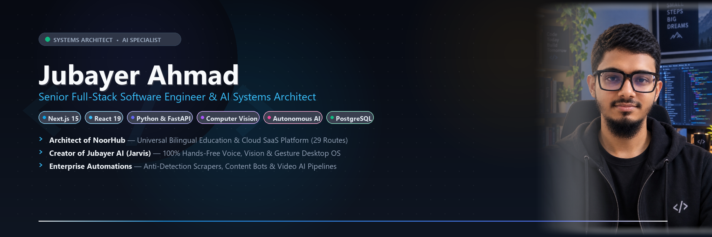

  

  

  
  
  

 

  <a href="#-about-me"><b>About Me</b></a> •
  <a href="#-tech-stack"><b>Tech Stack</b></a> •
  <a href="#-featured-projects"><b>Featured Projects</b></a> •
  <a href="#-github-stats"><b>GitHub Stats</b></a> •
  <a href="#-contact"><b>Contact</b></a>

---

### 👨‍💻 About Me

<table>
  <tr>
    <td width="38%" align="center" valign="middle">
      
    </td>
    <td width="62%" valign="middle">
      <h3>Jubayer Ahmad</h3>
      
<b>Senior Full-Stack Software Engineer & AI Systems Architect</b> based in <b>Dhaka, Bangladesh 🇧🇩</b>.

      
I engineer production-grade enterprise web platforms, complex multi-tenant SaaS applications, autonomous AI assistants, and high-throughput automation engines.

      <ul>
        <li>🚀 <b>Full-Stack SaaS Engineering:</b> Architect of <a href="https://github.com/Jubayer-AI-Studio/NoorHub-Madrasa-Management-SaaS">NoorHub</a> — an enterprise bilingual management platform featuring 29 completed routes, Leaflet GIS spatial mapping of Bangladesh, digital ID card engine, and offline PWA capability.</li>
        <li>🤖 <b>Autonomous AI Systems:</b> Creator of <a href="https://github.com/Jubayer-AI-Studio/Jubayer-Jarvis-AI-Automation">Jubayer AI</a> — a 100% hands-free personal desktop assistant with biometric voiceprint verification and real-time vision controls.</li>
        <li>⚡ <b>High-Scale Automation:</b> Designing resilient bot architectures with anti-detection heuristics, headless automation, and automated video generation engines.</li>
        <li>📬 <b>Direct Email:</b> <a href="mailto:monisharani333022@gmail.com">monisharani333022@gmail.com</a></li>
      </ul>
    </td>
  </tr>
</table>

---

### 🛠️ Tech Stack

#### 🌐 Frontend & Web Development

#### ⚙️ Backend, AI & Automation

#### 🗄️ Database, GIS & DevOps

---

### 🚀 Featured Projects

<table>
  <tr>
    <td width="50%" valign="top">
      <h3 align="center">📖 <a href="https://github.com/Jubayer-AI-Studio/NoorHub-Madrasa-Management-SaaS">NoorHub (নূরহাব)</a></h3>
      
<b>Universal Islamic Education Management & Cloud SaaS</b>

      
A production-ready bilingual (Bangla ⇄ English) cloud platform featuring 29 completed routes, Leaflet GIS division/district map of Bangladesh, digital student ID card generator with dynamic QR/Barcodes, and Noor AI speech assistant.

      
<b>Stack:</b> <code>Next.js 15</code> • <code>React 19</code> • <code>TypeScript</code> • <code>Tailwind CSS</code> • <code>PWA</code> • <code>Drizzle ORM</code> • <code>Gemini AI</code>

    </td>
    <td width="50%" valign="top">
      <h3 align="center">🤖 <a href="https://github.com/Jubayer-AI-Studio/Jubayer-Jarvis-AI-Automation">Jubayer AI (Desktop Jarvis)</a></h3>
      
<b>100% Hands-Free Voice & Gesture OS Assistant</b>

      
A personal Iron-Man style Desktop AI with an Arc Reactor Orb floating HUD, biometric voice authentication (owner frequency verification), QR-code smartphone WiFi remote, and full hands-free Windows automation.

      
<b>Stack:</b> <code>Python</code> • <code>OpenCV</code> • <code>SpeechRecognition</code> • <code>MediaPipe</code> • <code>CustomTkinter</code>

    </td>
  </tr>
  <tr>
    <td width="50%" valign="top">
      <h3 align="center">⚔️ <a href="https://github.com/Jubayer-AI-Studio/Shafin-Blade-Fighter-Game">Shafin Blade Fighter 3D</a></h3>
      
<b>Cross-Platform Arcade Combat Web Game</b>

      
An action-packed web fighting combat game featuring combo combat mechanics, audio feedback, customizable anime fighters, full offline PWA capability, and multi-resolution mobile/desktop touch controls.

      
<b>Stack:</b> <code>HTML5 Canvas</code> • <code>JavaScript (ES6+)</code> • <code>Web Audio API</code> • <code>PWA</code>

    </td>
    <td width="50%" valign="top">
      <h3 align="center">⚡ <a href="https://github.com/Jubayer-AI-Studio/AI__automation">Social Media & Reels AI Automator</a></h3>
      
<b>24/7 Automated Content & Interaction Pipeline</b>

      
Master desktop and cloud automation suite featuring 24/7 Telegram AI assistant workers, Facebook Video & Reels AI auto-commenter with randomized anti-bot delays, and batch short-video generators.

      
<b>Stack:</b> <code>Python</code> • <code>Selenium</code> • <code>Telegram Bot API</code> • <code>Gemini AI</code> • <code>FFmpeg</code>

    </td>
  </tr>
  <tr>
    <td width="50%" valign="top">
      <h3 align="center">🎙️ <a href="https://github.com/Jubayer-AI-Studio/Shono-AI-Bangladeshi-Jarvis">Shono AI (শোনো এআই)</a></h3>
      
<b>Bangladeshi Dialect-Aware Voice AI System</b>

      
Architectural blueprint and futuristic interactive HUD web interface designed for native regional Bangladeshi dialects (Sylheti, Chatgaya, Dhakaiya, etc.) and speech-to-intent pipelines.

      
<b>Stack:</b> <code>JavaScript</code> • <code>Web Speech API</code> • <code>Tailwind CSS</code> • <code>Cyberpunk HUD</code>

    </td>
    <td width="50%" valign="top">
      <h3 align="center">📺 <a href="https://github.com/Jubayer-AI-Studio/YouTube-Automation-Bot">YouTube Automation Engine</a></h3>
      
<b>Autonomous YouTube Publishing & Content Pipeline</b>

      
End-to-end Python engine automating thumbnail generation, metadata formatting, scheduling, and direct video uploads via YouTube Data API v3.

      
<b>Stack:</b> <code>Python</code> • <code>YouTube Data API v3</code> • <code>Pillow (PIL)</code> • <code>Google OAuth</code>

    </td>
  </tr>
</table>

---

### 📊 GitHub Stats

  
  

 

  

---

### 📬 Contact

  
  
  

