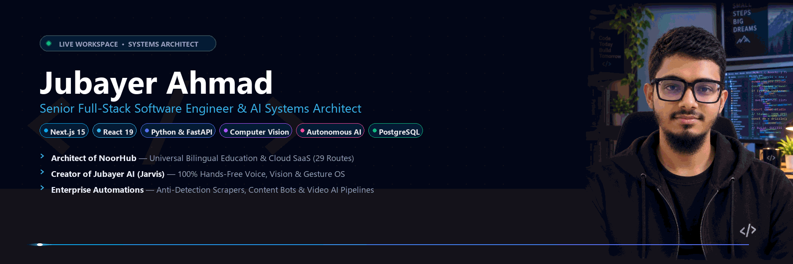

  

  

  
  
  
  

 

  <a href="#-about-me"><b>About Me</b></a> •
  <a href="#-core-capabilities"><b>Core Capabilities</b></a> •
  <a href="#-featured-production-projects"><b>Production Projects</b></a> •
  <a href="#-technical-arsenal"><b>Technical Arsenal</b></a> •
  <a href="#-github-stats"><b>GitHub Analytics</b></a> •
  <a href="#-contact--hire"><b>Contact & Hire</b></a>

---

### 👨‍💻 About Me

<table>
  <tr>
    <td width="36%" align="center" valign="middle">
      
    </td>
    <td width="64%" valign="top">
      <h3>Jubayer Ahmad</h3>
      
<b>Senior Full-Stack Software Engineer & Autonomous AI Systems Architect</b> based in <b>Dhaka, Bangladesh 🇧🇩</b>.

      
I specialize in architecting production-grade multi-tenant SaaS platforms, autonomous AI desktop agents, and high-throughput automation pipelines. I take complex business and engineering challenges and transform them into resilient, latency-optimized digital solutions.

      
      <h4>🎯 Core Philosophy & Principles</h4>
      <ul>
        <li>🌐 <b>Scalable Architecture First:</b> Engineering multi-tenant SaaS backends, relational schemas (PostgreSQL / Drizzle), and offline-first PWAs designed to scale cleanly.</li>
        <li>🤖 <b>Real-World AI Deployment:</b> Integrating generative AI, biometric voiceprint verification, and real-time computer vision into daily workflows.</li>
        <li>⚡ <b>High-Throughput Automation:</b> Building self-healing bots, anti-detection scrapers, and automated video rendering pipelines that run 24/7 without manual intervention.</li>
      </ul>
      
📬 <b>Direct Inquiries:</b> <a href="mailto:monisharani333022@gmail.com"><b>monisharani333022@gmail.com</b></a>

    </td>
  </tr>
</table>

---

### ⚡ Core Capabilities

<table>
  <tr>
    <td width="50%" valign="top">
      <h4>🌐 01. Enterprise SaaS & Cloud Platforms</h4>
      
Architecting multi-tenant, bilingual cloud platforms with Next.js 15, Drizzle ORM, spatial GIS mapping, dynamic QR ID generators, and offline PWA caching.

      
<code>Next.js 15</code> • <code>React 19</code> • <code>TypeScript</code> • <code>Drizzle ORM</code> • <code>PostgreSQL</code>

    </td>
    <td width="50%" valign="top">
      <h4>🤖 02. Autonomous AI & Computer Vision</h4>
      
Building 100% hands-free personal desktop operating systems with biometric voiceprint authentication, OpenCV vision tracking, and Google Gemini AI orchestration.

      
<code>Python</code> • <code>OpenCV</code> • <code>MediaPipe</code> • <code>Gemini AI</code> • <code>SpeechRecognition</code>

    </td>
  </tr>
  <tr>
    <td width="50%" valign="top">
      <h4>🔄 03. High-Scale Automation & Reverse Bots</h4>
      
Designing anti-detection scrapers, 24/7 multithreaded Telegram worker bots, and automated video generation engines leveraging FFmpeg and YouTube Data API v3.

      
<code>Selenium</code> • <code>Telegram Bot API</code> • <code>FFmpeg</code> • <code>YouTube API v3</code> • <code>OAuth2</code>

    </td>
    <td width="50%" valign="top">
      <h4>🎮 04. Interactive Canvas Engines & Web Gaming</h4>
      
Developing 60FPS browser combat arcade games with custom frame-accurate physics, Web Audio API sound engines, and multi-device touch controls.

      
<code>HTML5 Canvas</code> • <code>JavaScript (ES6+)</code> • <code>Web Audio API</code> • <code>PWA</code>

    </td>
  </tr>
</table>

---

### 🚀 Featured Production Projects

A curated selection of production-grade systems showcasing architectural depth, full-stack scalability, and real-world AI deployment:

 

#### 1. 📖 [NoorHub (নূরহাব) — Universal Islamic Education Management & Cloud SaaS](https://github.com/Jubayer-AI-Studio/NoorHub-Madrasa-Management-SaaS)
> **Status:** `🟢 PRODUCTION-READY SaaS` &nbsp;|&nbsp; **Scope:** `29 Completed Routes` &nbsp;|&nbsp; **Architecture:** `Multi-Tenant Bilingual Cloud`

* **The Problem & Solution:** Managing large-scale educational institutions in Bangladesh requires complex bilingual records, accounts, and regional reporting. NoorHub replaces disjointed spreadsheets with an enterprise cloud platform built for real-world reliability.
* **Key Engineered Capabilities:**
  * 🗺️ **Interactive GIS Spatial Mapping:** Integrated Leaflet GIS mapping all 8 administrative divisions and 64 districts of Bangladesh with institutional clustering.
  * 🪪 **Digital Student ID Card Engine:** Real-time ID card generator with dynamic QR codes, Code-128 barcodes, and print-ready CSS rendering.
  * ⚡ **29 Completed Application Routes:** Comprehensive student lifecycle, fees ledger, gradebooks, staff payroll, and admin controls.
  * 📱 **Offline-First PWA:** Service worker caching enabling offline functionality during unstable network connectivity.
  * 🎙️ **Noor AI Voice Assistant:** Voice-driven search and navigation powered by Gemini AI.
* **Stack:** `Next.js 15` • `React 19` • `TypeScript` • `Tailwind CSS` • `Drizzle ORM` • `PostgreSQL` • `Leaflet GIS` • `Gemini AI` • `PWA`
* **Repository:** [👉 Explore NoorHub Source Code](https://github.com/Jubayer-AI-Studio/NoorHub-Madrasa-Management-SaaS)

---

#### 2. 🤖 [Jubayer AI (Desktop Jarvis) — 100% Hands-Free Voice & Gesture OS](https://github.com/Jubayer-AI-Studio/Jubayer-Jarvis-AI-Automation)
> **Status:** `⚡ ACTIVE DEPLOYMENT` &nbsp;|&nbsp; **Interface:** `Floating Arc Reactor HUD` &nbsp;|&nbsp; **Control:** `Biometric Voice & Gesture`

* **The Problem & Solution:** Standard PC controls require mouse and keyboard interaction. Jubayer AI transforms a standard Windows computer into an Iron-Man style hands-free workstation with biometric owner authorization.
* **Key Engineered Capabilities:**
  * 🎙️ **Biometric Voiceprint Verification:** Owner voice frequency identification prevents unauthorized users from executing system commands.
  * 👁️ **Computer Vision & Gesture Control:** Real-time MediaPipe and OpenCV hand landmark tracking for volume modulation, scrolling, and window management.
  * 🌐 **Smartphone WiFi Remote:** Dynamic QR-code local network web dashboard allowing full smartphone control of the desktop.
  * 🔮 **Floating HUD Arc Reactor:** Interactive, draggable transparent floating desktop widget with real-time audio wave reactivity.
* **Stack:** `Python` • `OpenCV` • `MediaPipe` • `SpeechRecognition` • `CustomTkinter` • `Socket Networking`
* **Repository:** [👉 Explore Jubayer AI Source Code](https://github.com/Jubayer-AI-Studio/Jubayer-Jarvis-AI-Automation)

---

#### 3. ⚔️ [Shafin Blade Fighter 3D — Cross-Platform Arcade Combat Web Game](https://github.com/Jubayer-AI-Studio/Shafin-Blade-Fighter-Game)
> **Status:** `🎮 60 FPS OPTIMIZED` &nbsp;|&nbsp; **Engine:** `Custom HTML5 Canvas` &nbsp;|&nbsp; **Audio:** `Web Audio Synthesizer`

* **The Problem & Solution:** Heavy 3D game engines require massive downloads and high GPU overhead. Shafin Blade Fighter delivers a fast, responsive fighting game directly in any browser with instant loading.
* **Key Engineered Capabilities:**
  * 🕹️ **Custom 2D/3D Canvas Physics:** Frame-accurate hitboxes, velocity decay, knockback vectors, and combo chains.
  * 🔊 **Web Audio Synthesizer:** Procedural impact sounds and audio feedback without latency or asset lag.
  * 📱 **Adaptive Multi-Device Input:** Unified input system supporting physical keyboards, gamepads, and virtual on-screen touch controls.
  * 📦 **Offline PWA Engine:** Fully installable and playable offline without internet connectivity.
* **Stack:** `HTML5 Canvas` • `JavaScript (ES6+)` • `Web Audio API` • `PWA` • `CSS3`
* **Repository:** [👉 Explore Shafin Blade Fighter Source Code](https://github.com/Jubayer-AI-Studio/Shafin-Blade-Fighter-Game)

---

#### 4. ⚡ [Social Media & Reels AI Automator — 24/7 Content & Interaction Engine](https://github.com/Jubayer-AI-Studio/AI__automation)
> **Status:** `🤖 24/7 AUTONOMOUS` &nbsp;|&nbsp; **Heuristics:** `Anti-Detection Engine` &nbsp;|&nbsp; **Media:** `FFmpeg Automated Rendering`

* **The Problem & Solution:** Managing continuous customer outreach and content production requires 24/7 operational vigilance. This engine automates lead engagement, comment management, and short-video synthesis.
* **Key Engineered Capabilities:**
  * 💬 **24/7 Telegram AI Assistant:** Multithreaded bot continuously responding to user queries and executing automation workflows.
  * 🛡️ **Anti-Detection Automation:** Human-like randomized delays, natural cursor movement, and cookie session management bypassing automated bot filters.
  * 🎬 **Automated Reels Video Renderer:** Automated FFmpeg batch rendering pipeline compiling video clips, audio tracks, and animated overlays.
* **Stack:** `Python` • `Selenium` • `Telegram Bot API` • `Gemini AI` • `FFmpeg` • `Threading`
* **Repository:** [👉 Explore Social Media Automator Source Code](https://github.com/Jubayer-AI-Studio/AI__automation)

---

#### 5. 🎙️ [Shono AI (শোনো এআই) — Regional Dialect-Aware Voice AI System](https://github.com/Jubayer-AI-Studio/Shono-AI-Bangladeshi-Jarvis)
> **Status:** `🇧🇩 LOCALIZED SPEECH PIPELINE` &nbsp;|&nbsp; **UI:** `Cyberpunk Voice HUD`

* **The Problem & Solution:** Global voice assistants fail to understand regional Bengali dialects. Shono AI provides an architectural blueprint and interface tailored to native linguistic nuances (Sylheti, Chatgaya, Dhakaiya).
* **Key Engineered Capabilities:**
  * 🗣️ **Dialect-to-Intent Pipeline:** Maps spoken regional phonetics to structured API execution commands.
  * 🌌 **Cyberpunk Interactive HUD:** Real-time animated audio spectrum visualizer with cyberpunk aesthetics and live feedback.
* **Stack:** `JavaScript` • `Web Speech API` • `Tailwind CSS` • `Audio Context API`
* **Repository:** [👉 Explore Shono AI Source Code](https://github.com/Jubayer-AI-Studio/Shono-AI-Bangladeshi-Jarvis)

---

#### 6. 📺 [YouTube Automation Engine — Autonomous Video Publishing Pipeline](https://github.com/Jubayer-AI-Studio/YouTube-Automation-Bot)
> **Status:** `📈 CLOUD CONTENT PIPELINE` &nbsp;|&nbsp; **API:** `YouTube Data API v3`

* **The Problem & Solution:** Manual video publishing involves repetitive thumbnail generation, tag research, and scheduling. This engine automates the entire upload pipeline via official APIs.
* **Key Engineered Capabilities:**
  * 🎨 **Dynamic Thumbnail Engine:** Automated Pillow (PIL) graphic synthesis generating high-CTR thumbnails with custom typography and glow borders.
  * ☁️ **OAuth2 Scheduled Uploads:** Programmatic uploads to YouTube Data API v3 with quota tracking and automatic error recovery.
* **Stack:** `Python` • `YouTube Data API v3` • `Pillow (PIL)` • `Google OAuth`
* **Repository:** [👉 Explore YouTube Automation Source Code](https://github.com/Jubayer-AI-Studio/YouTube-Automation-Bot)

---

### 🛠️ Technical Arsenal

#### 🌐 Frontend & Web Development

#### ⚙️ Backend, AI & Automation

#### 🗄️ Database, GIS & DevOps

---

### 📊 GitHub Analytics

  
  

 

  

---

### 📬 Contact & Hire

<h3>Let's Build High-Impact Systems Together</h3>

Open for full-stack engineering, complex SaaS architecture, and autonomous AI system engagements.

